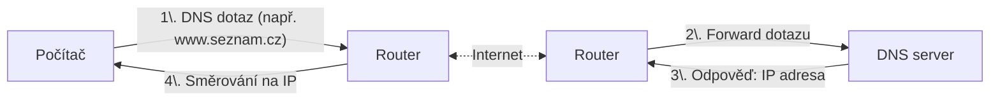
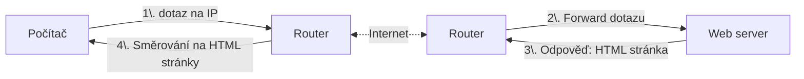

# Internet a síťová bezpečnost

- [Internet a síťová bezpečnost](#internet-a-síťová-bezpečnost)
  - [Z čeho se skládá Internet](#z-čeho-se-skládá-internet)
    - [HW](#hw)
      - [ISP](#isp)
    - [Protokoly](#protokoly)
      - [IP (Internet Protocol)](#ip-internet-protocol)
      - [DNS (Domain Name System)](#dns-domain-name-system)
      - [VPN](#vpn)

## Z čeho se skládá Internet 

- síťová infrastruktura (kabely, routery, switche, servery)
- protokoly (TCP/IP, HTTP, HTTPS, FTP, SMTP, DNS, DHCP)
- služby (webhosting, e-mailové služby, cloudové služby)
- uživatelé (koncoví uživatelé, administrátoři, vývojáři)

LAN, WAN, MAN, VPN

### HW

- Modem
- Hub
- Switch
- Router
- WiFi AP

#### ISP
Internet Service Provider (ISP) - poskytovatel internetu

Rychlost připojení k internetu a technologie:
- kbps
- mbps
- Gbps

Proč nepoužíváme jednotku B "Bajt" místo b "bit" za sekundu?
Aby nám prodejci internetu mohli nabítez 8x větší čísla (ale reálně stejnou rychlost).
Kolik je 8 Hobitů? Jeden Hobajt!

| Technologie        | Rychlost      | Popis                          |
|--------------------|---------------|--------------------------------|
| DSL                | až 100 Mbps   | Přes telefonní linku           |
| Kabelové připojení | až 1 Gbps     | Přes kabelovou televizi (koaxiální)       |
| Metalické kabely   | až 10 Gbps    | Vysokorychlostní připojení (ethernet)    |
| Optické vlákno     | až 10 Gbps    | Vysokorychlostní připojení     |
| Mobilní sítě (4G/5G) | až 1 Gbps     | Přes mobilní sítě  (BTS - LTE/5G)  |

### Protokoly
- IPv4
  - IP Adresa
- DHCP (Dynamic Host Configuration Protocol)
- NAT (Network Address Translation)
- DNS (Domain Name System)
- Firewall

#### IP (Internet Protocol)

UDP vs TCP

TCP/IP model

Jako pošták.

IP adresy:
- IPv4 vs IPv6
- privátní vs veřejné

- DNS servery

porty:
- NAT
- firewally
- aplikace
- port forwarding

#### DNS (Domain Name System)

Jak probíhá připojení mobilu/počítače do internetu k serveru?
AP, switch, router, modem -> routery -> DNS server -> routery -> WEB server 

Uživatel zadá do prohlížeče `www.seznam.cz`:

Počítač nyní zná `IP` adresu web serveru, na který chce přistoupit. Nyní odešle požadavek na web server:

Web server nyní ví, že uživatel chce načíst stránku. Odpoví mu `HTML` kódem, který prohlížeč vykreslí.

#### VPN

Jak vypadá VPN?
Kdy mě chrání?
- zabezpečuje komunikaci při připojování na stránky (banka, email,...) NE
- zabezpečuje komunikaci při připojování na wifi (kavárna, letiště) ANO
- zabezpečuje komunikaci od wifi po VPN server ANO
- zabezpečuje komunikaci od VPN server k WEB serveru se stránkou NE 

Co je to TOR?