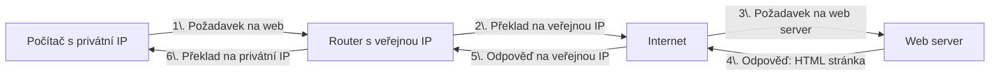
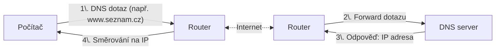
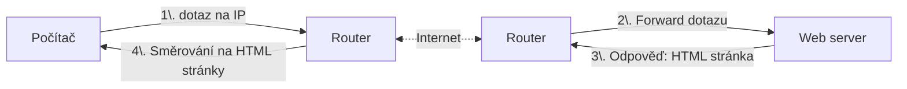

# Internet a síťová bezpečnost

- [Internet a síťová bezpečnost](#internet-a-síťová-bezpečnost)
  - [Z čeho se skládá Internet](#z-čeho-se-skládá-internet)
    - [OSI model](#osi-model)
    - [HW](#hw)
      - [ISP](#isp)
    - [Protokoly](#protokoly)
      - [IP (Internet Protocol)](#ip-internet-protocol)
      - [NAT (Network Address Translation)](#nat-network-address-translation)
      - [DNS (Domain Name System)](#dns-domain-name-system)
      - [VPN](#vpn)

## Z čeho se skládá Internet 

- síťová infrastruktura (kabely, routery, switche, servery)
- protokoly (TCP/IP, HTTP, HTTPS, FTP, SMTP, DNS, DHCP)
- služby (webhosting, e-mailové služby, cloudové služby)
- uživatelé (koncoví uživatelé, administrátoři, vývojáři)

LAN, WAN, MAN, VPN

MAC adresa vs IP adresa

Porty aplikací

packety:
- hlavička
- data
- kontrolní součet

### OSI model
| Vrstva | Funkce | Technologie / příklady |
|--------|--------|-----------------------|
| 7 — Aplikační (Application) | Rozhraní pro aplikace, síťové služby (web, e‑mail, přenos souborů) | HTTP, HTTPS, FTP, SMTP, DNS, POP/IMAP |
| 6 — Prezentace (Presentation) | Transformace dat, kódování, šifrování, komprese | SSL/TLS, MIME, JSON, XML |
| 5 — Relační (Session) | Řízení relací, navazování/ukončení spojení, synchronizace | NetBIOS, RPC, SDP |
| 4 — Transportní (Transport) | Spolehlivý/nespolehlivý přenos, segmentace, řízení toku | TCP, UDP, SCTP |
| 3 — Síťová (Network) | Směrování paketů, logická adresace | IPv4, IPv6, Routery, L3 switch |
| 2 — Linková (Data Link) | Rámcování, MAC adresování, detekce chyb, přístup k médiu | Ethernet, ARP, Switche, VLAN |
| 1 — Fyzická (Physical) | Přenos bitů po médiu, elektrické/optické/radiové signály | Kabely (UTP, coax, fiber), konektory, Wi‑Fi, modemy |

### HW

- Modem
- Hub
- Switch
- Router
- WiFi AP

UTP vs STP kabely

#### ISP
Internet Service Provider (ISP) - poskytovatel internetu

Rychlost připojení k internetu a technologie:
- kbps
- mbps
- Gbps

Proč nepoužíváme jednotku B "Bajt" místo b "bit" za sekundu?
Aby nám prodejci internetu mohli nabítez 8x větší čísla (ale reálně stejnou rychlost).
Kolik je 8 Hobitů? Jeden Hobajt!

| Technologie        | Rychlost      | Popis                          |
|--------------------|---------------|--------------------------------|
| DSL                | až 100 Mbps   | Přes telefonní linku           |
| Kabelové připojení | až 1 Gbps     | Přes kabelovou televizi (koaxiální)       |
| Metalické kabely   | až 10 Gbps    | Vysokorychlostní připojení (ethernet)    |
| Optické vlákno     | až 10 Gbps    | Vysokorychlostní připojení     |
| Mobilní sítě (4G/5G) | až 1 Gbps     | Přes mobilní sítě  (BTS - LTE/5G)  |

### Protokoly
- IPv4
  - IP Adresa
- DHCP (Dynamic Host Configuration Protocol)
- NAT (Network Address Translation)
- DNS (Domain Name System)
- Firewall

#### IP (Internet Protocol)

UDP vs TCP

TCP/IP model

Jako pošták.

IP adresy:
- IPv4 vs IPv6
- privátní vs veřejné

- DNS servery

porty:
- NAT
- firewally
- aplikace
- port forwarding

#### NAT (Network Address Translation)

> [!tip]
> NAT umožňuje více zařízením v lokální síti (s privátními IP adresami) sdílet jednu veřejnou IP adresu pro komunikaci s internetem.

Řeší problém nedostatku veřejných IP adres tím, že překládá privátní IP adresy na jednu veřejnou IP adresu.

Dále umožňuje skrytí vnitřní struktury sítě před vnějším světem, což zvyšuje bezpečnost.

Můj počítač v lokální síti má IP privátní IP adresu, jsem přes AP (wifi) připojený k routeru, který má veřejnou IP adresu. Mohu se připojit na webový server na internetu. Pokud ale někdo z internetu chce přistoupit na můj počítač, tak nemůže, protože ten má privátní IP adresu. Router neví na který počítač v lokální síti má požadavek přeposlat (bez nastavení port-forwardingu).

#### DNS (Domain Name System)

Jak probíhá připojení mobilu/počítače do internetu k serveru?
AP, switch, router, modem -> routery -> DNS server -> routery -> WEB server 

> [!note]
> Je to stejné, jako když znáte jméno svého kamrádat, ale nevíte kde bydlí. Zeptáte se někoho (DNS serveru), kdo to ví, a on vám řekne adresu (IP adresu).

Uživatel zadá do prohlížeče `www.seznam.cz`:

Počítač nyní zná `IP` adresu web serveru, na který chce přistoupit. Nyní odešle požadavek na web server:

Web server nyní ví, že uživatel chce načíst stránku. Odpoví mu `HTML` kódem, který prohlížeč vykreslí.

#### VPN

VPN
PPTP, IPsec, L2TP, SSL VPN

Jak vypadá VPN?
Kdy mě chrání?
- zabezpečuje komunikaci při připojování na stránky (banka, email,...) NE
- zabezpečuje komunikaci při připojování na wifi (kavárna, letiště) ANO
- zabezpečuje komunikaci od wifi po VPN server ANO
- zabezpečuje komunikaci od VPN server k WEB serveru se stránkou NE 

Co je to TOR?