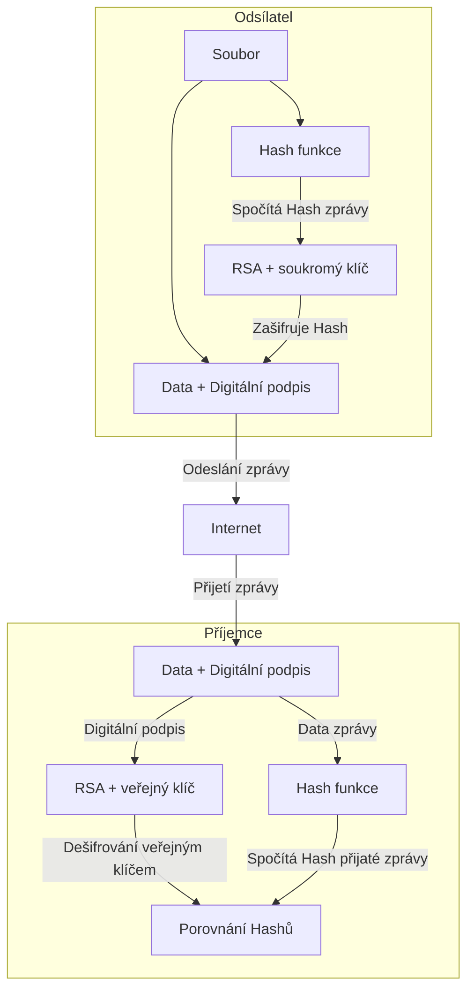

# Kódování a Šifrování

- [Kódování a Šifrování](#kódování-a-šifrování)
  - [Kódování](#kódování)
  - [Šifrování](#šifrování)
    - [Symetrická šifra](#symetrická-šifra)
    - [Asymetrická šifra](#asymetrická-šifra)
      - [Digitální podpis](#digitální-podpis)
      - [Digitální certifikát](#digitální-certifikát)

## Kódování

Kód, kódová abeceda, kódové slovo.

ASCII
Morseova abeceda

## Šifrování

### Symetrická šifra

Caesarova šifra
Transpoziční šifra

Google colab - python, jupyter notebook
Lámaná transpoziční šifry.

### Asymetrická šifra

RSA
Soukromý a veřejný klíč

Šifrování a dešifrování je jednosměrné. Pokud něko použije můj veřejný klíč k zašifrování zprávy, pak jenom já s privátíním klíčem dovedu tu zprávu rozšifrovat. 
Je jedno že více lidí zná veřejný klíč, jak je zpráva tímto klíčem jednou zašifrovaná, již nelze stejným klíče dešifrovat. 

#### Digitální podpis

Spočítám Hash souboru a pak jej zašifruji svým soukromým klíčem. 

#### Digitální certifikát
> [!tip] CA - Certifikační autority
Podepisují že k danému veřejnému klíči náleží daný vlastník.

Navázání na sítovou bezpečnost

SSL
TLS

Zkontrulujte že web který navštevujete má platný cetifikát a zjistěte kdo jej vydal do kdy je platný.
HTTPS využívá TLS cetifikáty